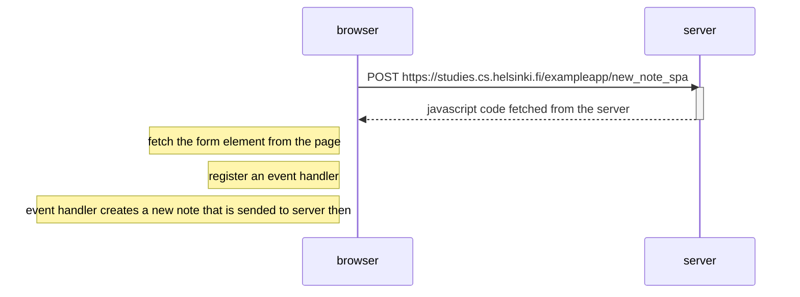

```mermaid
sequenceDiagram
    participant browser
    participant server

    browser->>server: POST https://studies.cs.helsinki.fi/exampleapp/new_note_spa
    activate server
    server-->>browser: javascript code fetched from the server 
    deactivate server

    Note left of browser: fetch the form element from the page
    Note left of browser: register an event handler

    Note left of browser: event handler creates a new note that is sended to server then 

```

